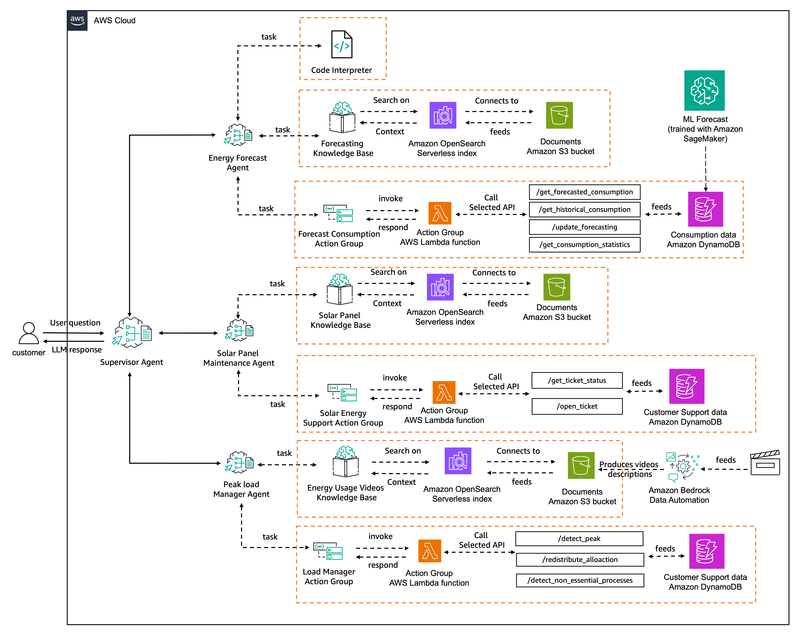

# Energy Efficiency Management System - Multi-Agent Workshop

## Overview

This public AWS workshop showcases the new Amazon Bedrock Agents feature - [multi-agent collaboration capabilities](https://docs.aws.amazon.com/bedrock/latest/userguide/agents-multi-agent-collaboration.html) - through an Energy Efficiency Management System.
The system consists of a supervisor agent that orchestrates three specialized sub-agents, each handling specific aspects of energy management and customer service.

## System Architecture

```
├── 1- Forecasting Agent
├── 2- Solar Panel Agent
├── 3- Peak Load Manager Agent
├── 4- Energy Efficiency Management Agent (Supervisor)
└── 5- Clean up
```

## Agents Description

### Energy Efficiency Management Agent (Supervisor)

The supervisor agent coordinates the activities of three specialized sub-agents,
routing customer queries and requests to the appropriate agent while maintaining context and
ensuring seamless interactions. The architecture looks as following:



### Sub-Agents

#### 1. Forecasting Agent

- Provides current energy consumption data
- Provides consumption forecasts
- Provides user consumption statistics
- Contains code interpretation capabilities to analyze forecasting data

#### 2. Solar Panel Agent

- Provides installation guidelines and requirements
- Offers maintenance instructions and schedules
- Enables support ticket creation
- Tracks existing support tickets

#### 3. Peak Load Manager Agent

- Identifies non-essential processes
- Analyzes peak vs. off-peak usage
- Optimizes grid allocation

## Workshop Contents

1. Forecast agent setup
2. Solar panel agent setup
3. Peak load manager agent
4. Multi-agent collaboration setup
5. Supervisor agent invocation
6. Clean up

## Prerequisites

- AWS Account with appropriate permissions
- Amazon Bedrock access
- Basic understanding of AWS services
- Python 3.8+
- Latest Boto3 SDK
- AWS CLI configured
